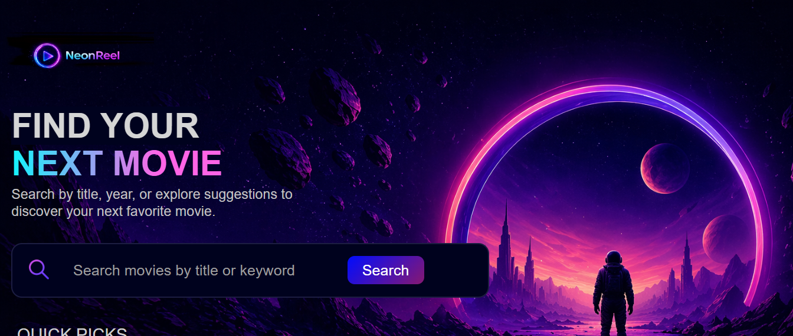
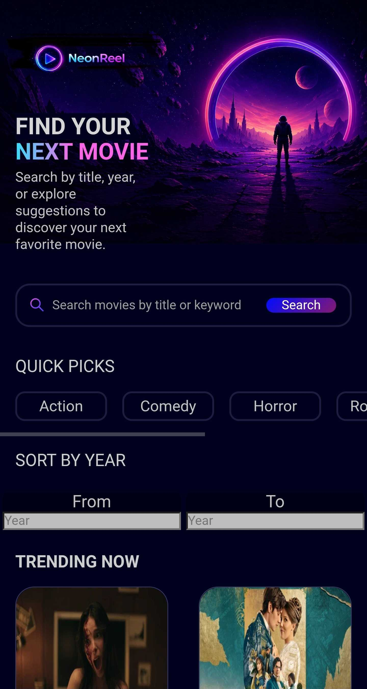

# Neon Reel 
[Live Page](https://james-york2008.github.io/neonReel/)




## About: 
Neon Reel is a movie discovery web application made using the TMDB API. Users can browse movies, filter by genre and release year, and discover random movies that match the selected filters. The application was made to prioritize accessibility, maintainable design, and user experience.

## API Key Notice:
One important note regarding this project is it does not use a backend, and in turn the TMDB API key is exposed. This is not ideal for production-level web applications, and for this project I plan to actively maintain and replace the API key as necessary. I have created a .env file and stored the key there so that it isn't exposed on GitHub, but I am aware it is still exposed in the compiled application.

## Features:
- **Dynamic Rendering:** Dynamically rendered movie cards
- **Movie Filters:** Dynamic movie filters for year and genres
- **Movie Randomization:** Randomized movie selection that complies with the filters
- **Modern Routing:** Built with React Router for navigation and error recovery
- **Responsive Design:** Designed to function well on desktop and mobile

## Tech Stack: 
- **Framework:** ReactJS 
- **Language:** TypeScript 
- **Styling:** CSS 
- **Third-Party APIs:** TMDB API
- **Build Tool:** Vite

## Run Locally:

Clone the repository:
```bash
git clone https://github.com/james-york2008/neonReel
cd neonReel
```


Install dependencies:
```bash
npm install
```


Create a `.env` file in the project root and add your TMDB API key:
```bash
VITE_TMDB_API_KEY=YOUR_KEY_HERE
```


Start the development server:
```bash
npm run dev
```


Open the application in your browser at:
`http://localhost:5173`


Note: 
The `.env` file is not included in the repository, so you'll need to provide your own key. You can obtain an API key from [The Movie Database](https://developer.themoviedb.org/docs/getting-started)


## React Migration:
**State Management:** One of the biggest challenges faced during the React migration was managing state across multiple components. In older versions, I declared the movie state in multiple components, which caused inconsistent behaviors and unnecessarily complex logic. Refactoring the application to centralize state ownership greatly improved reliability.


**Random Movie Selection:** Implementing the random movie feature presented additional challenges when filters were introduced. Ensuring the random selector respected active genre and year filters required rewriting several fetch requests and carefully managing query parameters.


**TypeScript Integration:** Working with TypeScript highlighted the importance of properly defining data structures. Creating dedicated movie and genre types reduced errors and improved the debugging experience.


**Deployment and Configuration:** Deploying the React version to GitHub Pages displayed a configuration error where the page would crash and simply white screen. This bug was caused by the Vite config file not having a base path. Troubleshooting this problem, and many similar to it, provided experience with build tools and frontend deployment workflows.


## Accessibility Improvements:
### Color Contrast
- Compared text with the brightest and darkest regions of the hero image to ensure standard compliant contrast ratios
- Redesigned various gradients used throughout the site to maintain color contrast ratios from 7:1 to 15:1

### Layout
- Moved movie titles beneath posters instead of displaying them on top of them to fix potential contrast issues
- Added text overflow handling with ellipses to prevent layout issues on longer movie titles
- Reworked heading hierarchy to a logical structure
- Removed the search icons functionality and made it purely decorative to reduce cognitive load

### Screen Reader Improvements
- Hid movie poster images from screen readers because they provide no substantial value that isn't provided by the title
- Removed unnecessary browser autocomplete from the search field to create a smoother experience

### Keyboard Navigation
- Added visible focus indicators to genre filters
- Implemented support for using the Enter key to select or deselect genre filters

### Program Quality and Maintainability
- Standardized inconsistent quotation mark usage throughout the program for better readability
- Made the landing page its own component instead of assembling it in App to make the application more scalable
- Implemented URL error handling with React Router to navigate users to the landing page

## Potential Future Improvements: 
- Make search and filter functionalities work together seamlessly. 
- Create or commission a backend to securely store the API key. 
- Explore TMDB's watch-provider integrations to display where movies can be streamed or purchased.